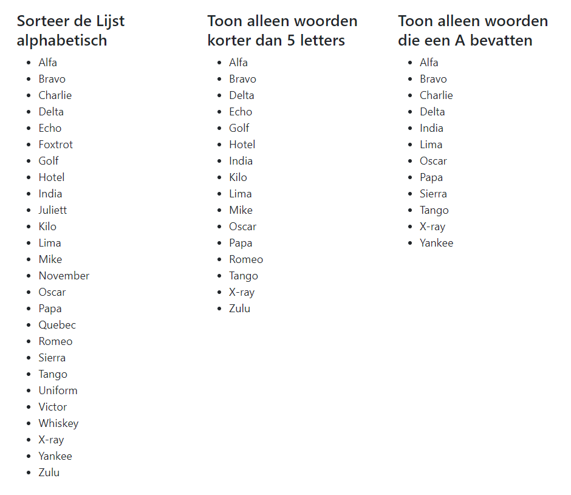

# p3_Frontend - Opdracht 1

In deze opdracht moet je lijst manipulaties uitvoeren.

Draai de applicatie via Xampp. Je ziet drie lijsten. Boven iedere lijst staat een actie die je moet uitvoeren op de lijst.

In het javascript bestand [script.js](script.js) vind je drie functies waarin jij de lijst manipulatie moet uitvoeren.

- sortList()
- removeLongerThanFive()
- getWhereIncludesA()

## Inleveren

Lever de opdracht in door je werk te pushen (stage, commit, push).

Maak daarna een screenshot van je commit history op gitHub.com en upload de screenshot naar ItsLearning om de opdacht te vooltooien.

## nuttige links

- [w3Schools - array methods](https://www.w3schools.com/jsref/jsref_obj_array.asp)
- [w3Schools - array sort](https://www.w3schools.com/jsref/jsref_sort.asp)
- [w3Schools - array filter](https://www.w3schools.com/jsref/jsref_filter.asp)
- [w3Schools - string includes](https://www.w3schools.com/jsref/jsref_includes.asp)

## Correct resultaat

